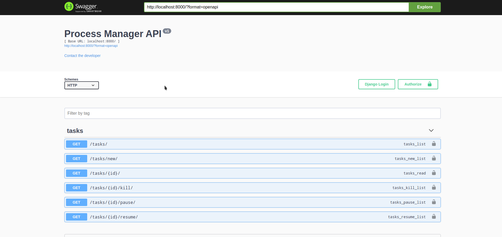

# process_manager
REST API Server that can be used to create processes, pause them, resume or terminate them. Basically everytime `/tasks/new` endpoint is called it creates a new instance of `sample_process.py`.

## Screenshot

## Technologies Used
- Django Rest Framework
- Swagger API Testing/Documentation

## Running the project
- `docker-compose up`
- Apply the database migrations. (One Time Only - When a new postgres container is created) using `docker-compose run web python manage.py migrate`.

Voila! We are done!
